## Our Project

This project was implemented using Keras and TensorFlow where the CNN (Convolutional Neural Network) model was trained for face mask detection.

## Why Face Mask Detection?

With the ongoing pandemic not slowing down as much as initially thought, it remains vital to ensure that the services and buildings that need extra security have it. Being in a college campus with over 40,000 students means that often times, academic and social buildings will require students to be in close proximity to each other indoors, and with new variants of COVID-19 popping up, we think that face mask detection is more crucial here and around the world more than ever. 

## So Why Us?

While the model we used may not be as accurate as the current state of the art, which we will touch on later, we found that this idea was the best way to make a real-world connection to the material we learned in class. We believe that for the time we were given and based off what we know as students, not professionals, that we created something we should be proud of. 

## Approach

Originally in our proposal and in our mid-semester progress report, we stated that we wanted to try implementing the YOLOv3 model, and though we seriosuly tried to do so, we unfortunately ran into some problems implementing it, so we decided to switch over to our own simpler CNN model. We used TensorFlow and Keras to train this model based off a dataset consisting of over 4,000 images (2166 images with properly-masked people and 1931 images of individuals not masking properly). 

Examples: 

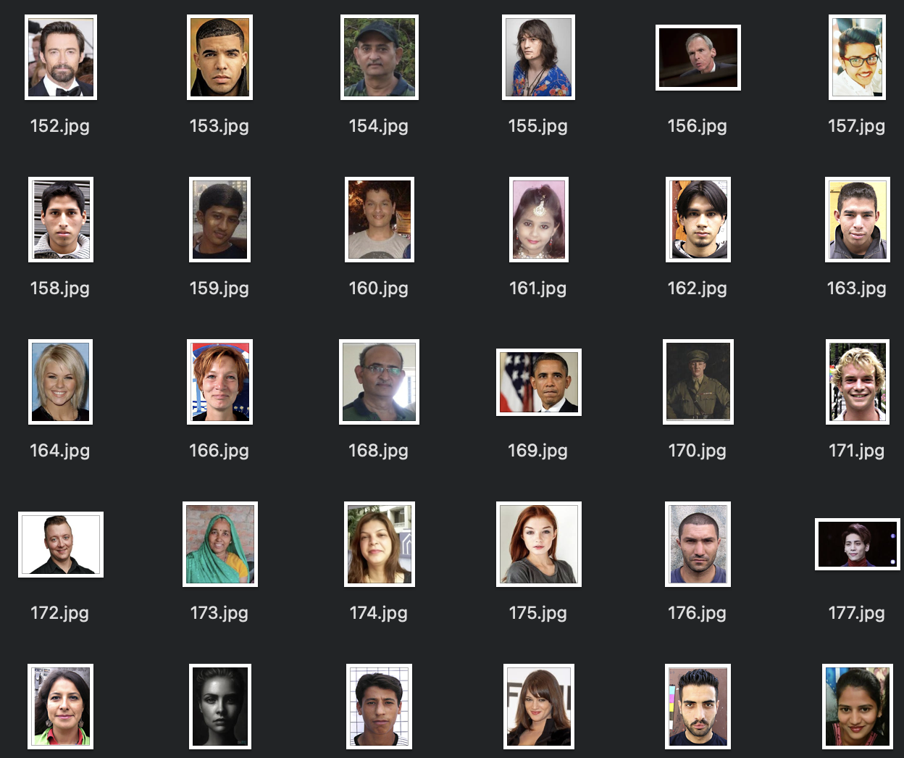
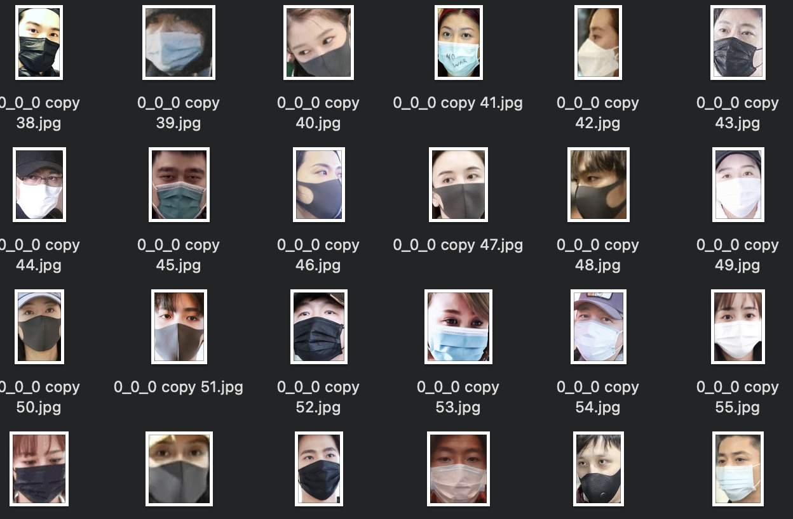

## Implementation
Data Collection
First, we gathered mask and without mask images from open source databases, Kaggle dataset and the Real-World Masked Face dataset (RMFD)

- Preprocessing
Images are preprocessed to make them the same shape.
Next, they are grouped into training/test images.

- Building and Training the model
Creating and building the model produces an untrained neural network (CNN in our case).
Training the model uses the images and labels to “train” the data.
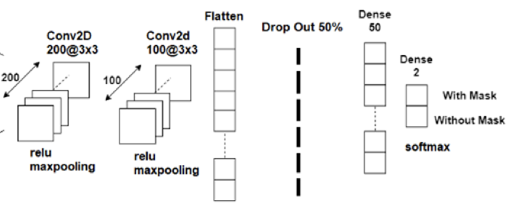

- Convolution
We used Convolutional neural networks to extract features from images that we can feed through a traditional neural network to get a predicted output. Convolution works by iterating a small filter over the entire image and storing its output matrix that will then be used for the next layer.

- Relu Functions
The network consists of two convolution layers each followed by a Rectified Linear Unit activation function and a max pooling layer.
Rectified Linear Unit function is introduced for non-linearity in the convolutional network. It is the most widely used activation function for computer vision and is useful feature extraction.

- Max Pooling
Pooling layers is used after a few Convolutional Layers. It will reduce the dimension of the convolution matrices making it faster. Max pooling is the most widely used type of pooling for computer vision problems, and will take the largest element from the rectified feature map.

- Flatten Layers
The data is then flattened by converting it to 1- dimensional array which is passed as the input to the final output layer. To help prevent overfitting, the network ignores a certain percentage of neurons during training. The final output layer takes the values and transforms them into a probability distribution, this is achieved with the help of softmax function.The final prediction will be based on the class that has the highest probability.

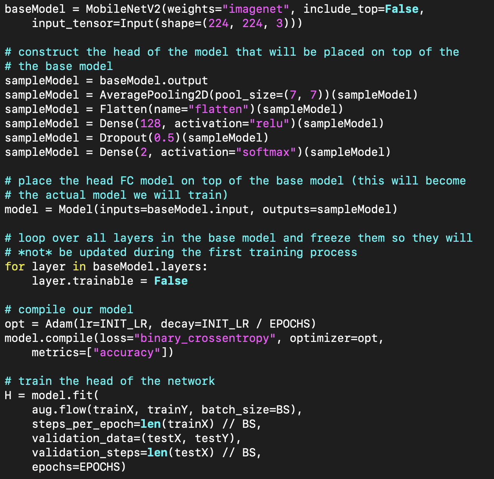

## Results

The model was then compiled using Adam optimizer.  We ran our model for 20 epochs with a batch size of 128. We were able to achieve an accuracy rate of about 96%. Model accuracy (how much of the data the model predicts correctly) initially increases rapidly, but then slowly levels off at higher epochs. Model Loss decreases as epochs increase. Model loss is the penalty for making an incorrect prediction.
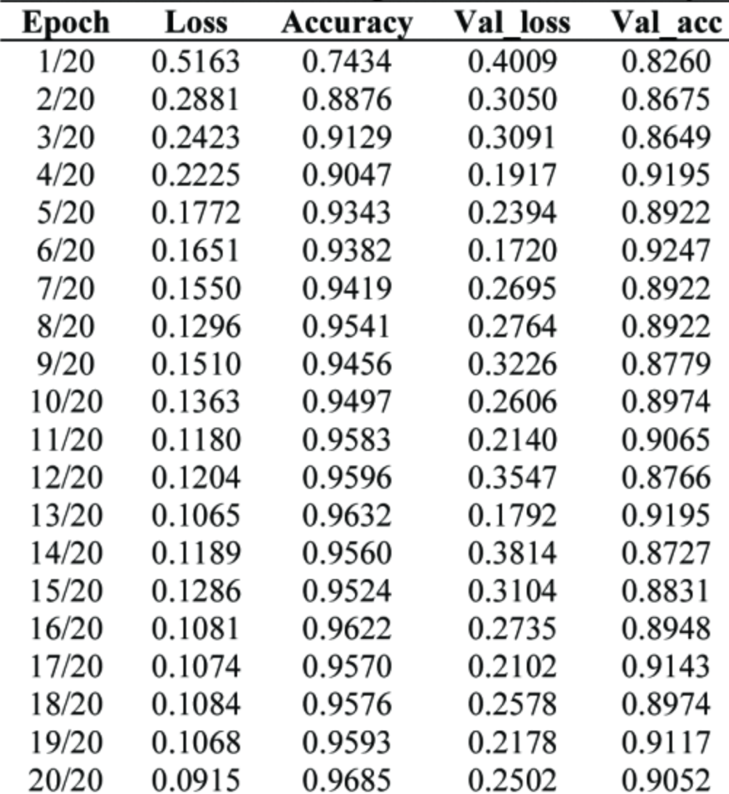

We applied sample input images that has been processed using a previously built model.
Here are sample images result images from prediction models.
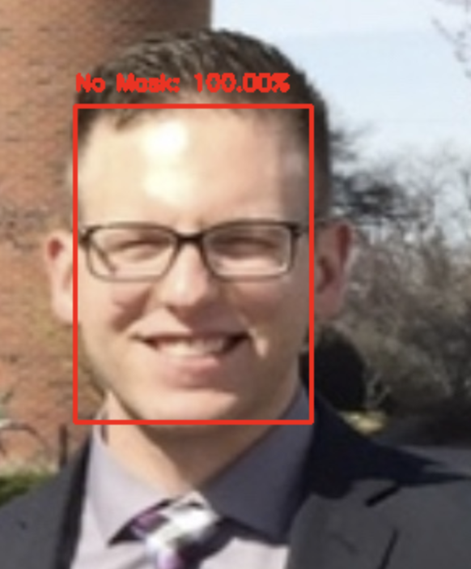
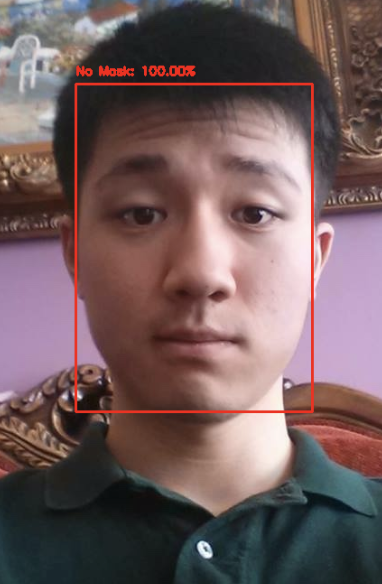
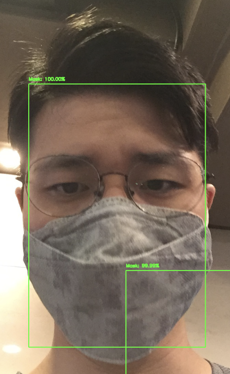
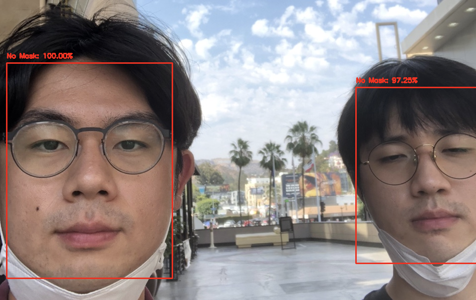
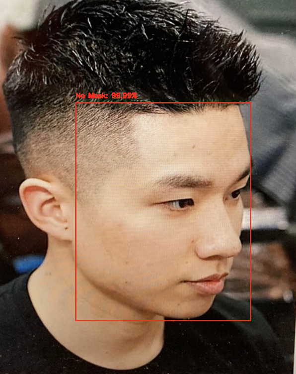
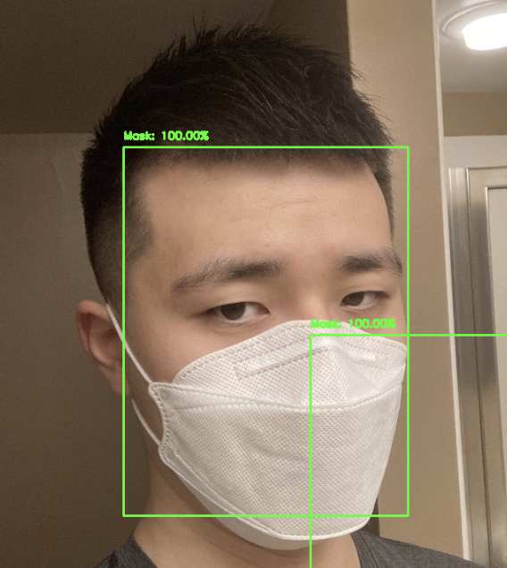

Feel free to also look at the presentation [here](https://docs.google.com/presentation/d/1l14B7fbgHDIT6jHU58RYDVzhiC0WSFaI7jZAeX67ut4/edit?usp=sharing) and our source code [Source Code](https://github.com/jkim574/Face_Mask_Detection)

## Problems Encountered

As stated before, our initial idea was to implement the YOLOv3 model, but we encountered a few problems along the way. Here are some of them.

Add here

## Other Links

[Project Proposal](https://docs.google.com/document/d/1SuapIt2qn2yRM3lHKjUMKJwnN7TPx1Ui1NvxnjrIr0I/edit?usp=sharing) 

[Midterm Progress Report](https://docs.google.com/document/d/1qgoP2MN_5OZ7F9PtP0Lrr-lns17X9DM5qZlm3ibzav8/edit?usp=sharing)

## Sources

Below is a list of names and links to open source databases of mask and without mask images used in this project.
https://data-flair.training/blogs/download-face-mask-data/
